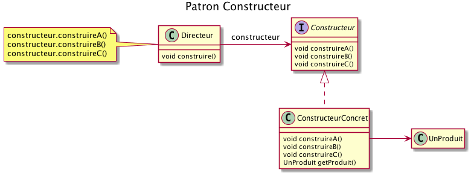

# Le patron de conception Builder

Le but du patron de conception Builder est de permettre la construction d'un objet complexe sans ce soucier de sa
représentation afin d'utiliser le même processus de construction
pour différentes représentations.



On distingue deux rôles importants dans ce patron de conception :

- La classe `Directeur`, qui connaît la structure de l'objet à construire, c'est à dire la décomposition du produit en briques de base.
- Les classes qui réalisent l'interface `Constructeur` : elles savent comment 
construire un produit à partir de briques de bases. Chaque réalisation de l'interface 
permet de construire un nouveau type d'objets.


  
L'exemple typique est l'exportation d'un document d'un format à un autre.

Dans cet exercice, nous allons réaliser un outil qui permet de transformer un document structuré en [markdown](https://daringfireball.net/projects/markdown/syntax) en un document HTML ou RTF.

Le rôle de la classe `Directeur` sera donc de repérer la structure du fichier initial
en markdown : les titres, les paragraphes, le texte souligné, le texte en gras. Ce sont les briques de base qui seront prises en charge par les constructeurs. 

On pourra utiliser l'interface `Constructeur` suivante par exemple :

```java

public interface Constructeur {

    void onParagraphBegin();
    
    void onParagraphEnd();
    
    void buildHeader1(String s);
    
    void buildHeader2(String s);
    
    void buildHeader3(String s);
    
    void onBeginUnsortedList();
    
    void buildListItem(String s);
    
    void onEndUnsortedList();
    
    void buildRawText(String s);
    
    void buildBold(String s);
    
    void buildItalic(String s);
    
    String getResult();
}
```
La classe `Directeur` devra appeler les méthodes de l'interface `Constructeur` à chaque fois que des éléments de la structure du
documents ont été repérés.

Nous aurons ensuite deux réalisation de cette interface : une pour un export HTML, l'autre pour un export en RTF.

Voici une table de conversion de markdown vers HTML ou RTF.

| Element  | Markdown | HTML | RTF |
|----------|----------|------|-----|
| début paragraphe  | `<ligne vide>` | `<p>` | `{\pard `  |
| fin paragraphe    | `<ligne vide>` | `</p>` | ` \par}` |
| début liste       | `<ligne vide>` | `<ul>`| `\line{\pard\li500\ql`   |
| item liste        | `+  item` | `<li> item </li>`| `{\b * } item \line`    |
| fin liste         | `<ligne vide>` | `</ul>`| `\line\par}`  |
| titre 1           | `# titre 1` | `<h1>titre 1</h1>`| `{\pard\qc\b\fs40 titre 1 \par}` |
| titre 2           | `## titre 2` | `<h2>titre 2</h2>`| `{\pard\qc\b\fs30 titre 2 \par}` |
| titre 3           | `### titre 3` | `<h3>titre 3</h3>`| `{\pard\qc\b\fs20 titre 3 \par}` |
| gras              | `**gras**`    | `<b>gras</b>`| `{\b gras }` |
| italique          | `_italique_`   `*italique*` | `<i>italique</i>`| `{\i italique }` |

Les corps des documents seront les suivants :

## HTML

```
<html>
  <body>
  ...
  </body>
</html>
```

## RTF

```
{\rtf1\ansi\deff0{\fonttbl{\f0 Times New Roman;}}
{\header\pard\qr\plain\f0\chpgn\par}
...
}
```

# Exemple d'utilisation

## Fichier markdown

```
# Un titre

Un paragraphe **avec du texte en gras**.

+ item 1
+ item 2
+ item 3

Un autre **para** avec **deux** mots en gras.

## titre 2

Un autre paragraphe avec du texte _en italique_.

## titre 2

dernier
```

## Vu par la forge

# Un titre

Un paragraphe *avec du texte en gras*.

+ item 1
+ item 2
+ item 3

Un autre *para* avec *deux* mots en gras.

## titre 2

Un autre paragraphe avec du texte _en italique_.

## titre 2

dernier

## Traduit en HTML

```html
<html>
<body>
<h1>Un titre</h1>
<p>Un paragraphe <b>avec du texte en gras</b>.</p>
<ul>
<li>item 1</li>
<li>item 2</li>
<li>item 3</li>
</ul>
<p>Un autre <b>para</b> avec <b>deux</b> mots en gras.</p>
<h2>titre 2</h2>
<p>Un autre paragraphe avec du texte <i>en italique</i>.</p>
<h2>titre 2</h2>
<p>dernier</p>
</body>
</html>

```
## Traduit en RTF

```
{\rtf1\ansi\deff0{\fonttbl{\f0 Times New Roman;}}
{\header\pard\qr\plain\f0\chpgn\par}
{\pard\qc\b\fs40
Un titre\par}
{\pard
Un paragraphe {\b avec du texte en gras }
\par}
\line
{\pard\li500\ql
{\b * }item 1\line
{\b * }item 2\line
{\b * }item 3\line
\line
\par
}
{\pard
Un autre {\b para } avec {\b deux }
\par}
{\pard\qc\b\fs30
titre 2\par}
{\pard
Un autre paragraphe avec du texte _en italique_.
\par}
{\pard\qc\b\fs30
titre 2\par}
{\pard
dernier
\par}

}

```

Réaliser les deux implémentations de l'interface `Constructeur` ne pose aucune difficulté : il suffit de se référer à la table ci-dessus. Le squelette des deux classes `HTML` et `RTF` est fourni.

La reconnaissance de la structure markdown est par contre un peu plus complexe.

L'idéal est de la réaliser en 3 temps :

1. Réaliser une classe `Directeur` simple qui ne repère que les titres des documents markdown. Vérifier que lorsque l'on change de réalisation de `Constructeur`, on obtient bien un produit différent.
1. Ajouter la notion de paragraphe et de liste non triée. La principale difficulté est de repérer le début et la fin de ces structures. Préparer quelques fichiers de tests et vérifiez le comportement de votre classe `Directeur`.
1. Ajouter enfin la gestion du gras et de l'italique. On supposera
que les marqueurs de début et fin de gras et d'italique sont sur une même ligne et ne se chevauchent pas.

Vous disposez de deux scripts (`build.sh` et `test.sh`) pour vous permettre de tester votre travail sur des exemples de traduction en HTML.

> Vous devez faire un "fork" du projet original qui vous permettra de déposer votre travail sur la forge. Les tests seront exécutés de manière automatique (intégration continue). Vous obtiendrez 1 point par test qui passe (5 points au total).
Cette semaine, vous devez rendre un lien vers votre projet sur la forge, pas un jar.

Exemples :

Correct (doit fonctionner)

```
Ceci est un *texte en italique* et **un texte en gras**.
```

Pas supporté (vous n'avez pas à gérer ce cas)

```
Ceci est un *texte en italique* et **un texte 
en gras**.
```

Interdit (c'est incorrect en format markdown)
```
Ceci est un *texte en **italique* et gras**.
```

